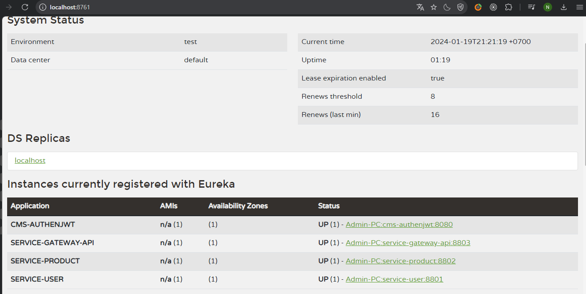

# Thêm thông tin người dùng và danh sách các sản phẩm
# Công nghệ sử dụng
- Spring Boot
- MySQL
- RestTemplate
- Spring Clound
- JWT
- Gateway
- Docker Compose
# Service Registry

# Xác thực người dùng

# Thông tin về service người dùng khi jwt qua gateway 

# Service về danh sách product khi jwt goi qua gateway

