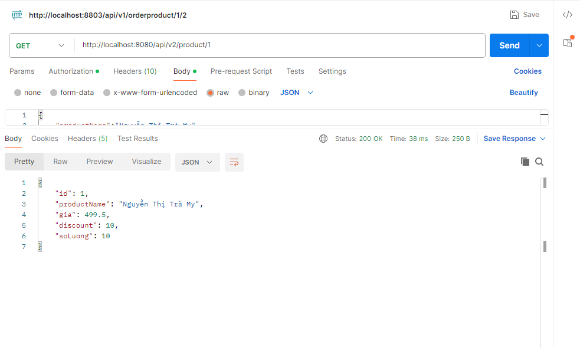

<<<<<<< HEAD
# Service Registry

# Xác thực người dùng

# Thông tin về service người dùng khi jwt qua gateway 

# Service về danh sách product khi jwt goi qua gateway

=======
# CRUD REDIS

# CRUD Spring

>>>>>>> redis
